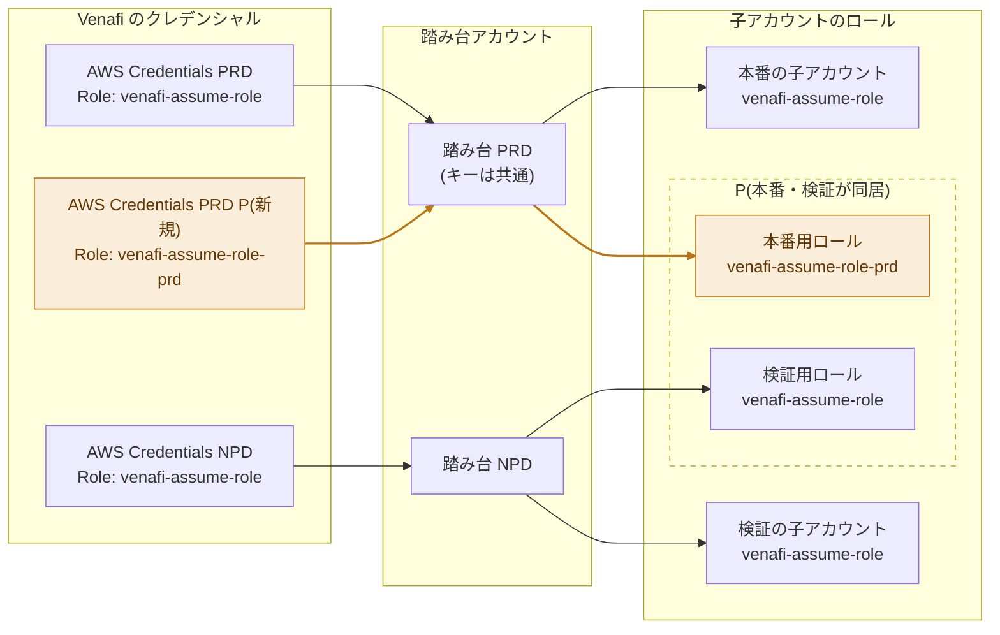

```mermaid
flowchart LR
  subgraph V["Venafi のクレデンシャル"]
    C1["AWS Credentials PRD<br/>Role: venafi-assume-role"]
    C2["AWS Credentials PRD P(新規)<br/>Role: venafi-assume-role-prd"]
    C3["AWS Credentials NPD<br/>Role: venafi-assume-role"]
  end

  subgraph B["踏み台アカウント"]
    B1["踏み台 PRD<br/>(キーは共通)"]
    B2["踏み台 NPD"]
  end

  subgraph A["子アカウントのロール"]
    R1["本番の子アカウント<br/>venafi-assume-role"]
    subgraph P["P(本番・検証が同居)"]
      R2["本番用ロール<br/>venafi-assume-role-prd"]
      R3["検証用ロール<br/>venafi-assume-role"]
    end
    R4["検証の子アカウント<br/>venafi-assume-role"]
  end

  C1 --> B1
  C2 --> B1
  C3 --> B2
  B1 --> R1
  B1 --> R2
  B2 --> R3
  B2 --> R4

  classDef changed fill:#FAEEDA,stroke:#BA7517,color:#633806
  class C2,R2 changed
  style P stroke-dasharray: 5 5
  linkStyle 1,4 stroke:#BA7517,stroke-width:2px
```
