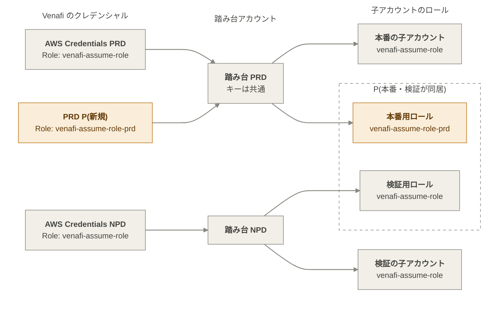

```mermaid
%%{init: {"theme": "base", "themeVariables": {
  "background": "#FFFFFF",
  "primaryColor": "#F1EFE8",
  "primaryBorderColor": "#888780",
  "primaryTextColor": "#444441",
  "lineColor": "#888780",
  "clusterBkg": "#FFFFFF",
  "clusterBorder": "#FFFFFF",
  "titleColor": "#444441",
  "fontSize": "14px"
}}}%%
flowchart LR
  subgraph V["Venafi のクレデンシャル"]
    C1["<b>AWS Credentials PRD</b><br/>Role: venafi-assume-role"]
    C2["<b>PRD P(新規)</b><br/>Role: venafi-assume-role-prd"]
    C3["<b>AWS Credentials NPD</b><br/>Role: venafi-assume-role"]
  end

  subgraph B["踏み台アカウント"]
    B1["<b>踏み台 PRD</b><br/>キーは共通"]
    B2["<b>踏み台 NPD</b>"]
  end

  subgraph A["子アカウントのロール"]
    R1["<b>本番の子アカウント</b><br/>venafi-assume-role"]
    subgraph P["P(本番・検証が同居)"]
      R2["<b>本番用ロール</b><br/>venafi-assume-role-prd"]
      R3["<b>検証用ロール</b><br/>venafi-assume-role"]
    end
    R4["<b>検証の子アカウント</b><br/>venafi-assume-role"]
  end

  C1 --> B1
  C2 --> B1
  C3 --> B2
  B1 --> R1
  B1 --> R2
  B2 --> R3
  B2 --> R4

  classDef normal fill:#F1EFE8,stroke:#888780,stroke-width:1px,color:#444441
  classDef changed fill:#FAEEDA,stroke:#BA7517,stroke-width:1px,color:#633806
  class C1,C3,B1,B2,R1,R3,R4 normal
  class C2,R2 changed

  style V fill:#FFFFFF,stroke:#FFFFFF,color:#444441
  style B fill:#FFFFFF,stroke:#FFFFFF,color:#444441
  style A fill:#FFFFFF,stroke:#FFFFFF,color:#444441
  style P fill:#FFFFFF,stroke:#888780,stroke-width:1px,stroke-dasharray: 5 5,color:#444441
  linkStyle default stroke:#888780,stroke-width:1.5px
```